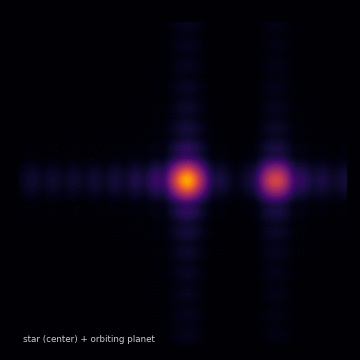

# DAQIRI-MIXER



A real-time int8 tensor-core covariance correlator on one RTX 5070, fed by a 400 GbE F-engine stream at ~98% of line rate: it computes per-channel visibilities `V = X·Xᴴ` and images them as a 128-channel 32×32 cube. The 16×16 array is filled and Nyquist-sampled, so one batched cuFFT of `V` forms *every* beam in the field of view at once (above: a star at field center plus an orbiting planet, one channel of the cube). The analytic-sky transmitter `bf_tx_fp8.cu` is a test signal source, not part of the correlator.

The NIC capture/transmit runs on [NVIDIA daqiri](https://github.com/NVIDIA/daqiri), which moves raw Ethernet packets between the ConnectX-7 and the GPU (ibverbs/DPDK engines, GPUDirect, flow steering). Everything here links `libdaqiri` and runs inside the `daqiri:local` container.

## Run

Build on both hosts, then run the correlator on the receiver (RTX 5070) and the signal source on the transmitter (A6000):

```bash
bash scripts/build.sh    # bf_rx_host_corr + bf_peek32 (sm_120a) and bf_tx_fp8 (sm_86)
bash scripts/run_rx.sh   # receiver:    correlator -> /dev/shm/bf_corr32
bash scripts/run_tx.sh   # transmitter: analytic sky (star + orbiting planet)
./bf_peek32 120          # view a channel of the image cube (120 = high freq, bright planet)
```

For full line rate, pin the receiver GPU clocks first — the 5070 idles its PCIe link to Gen1 otherwise.

## Configuration

The two YAMLs are [daqiri](https://github.com/NVIDIA/daqiri) stream configs (the `daqiri.cfg` block). The RX/TX asymmetry *is* the architecture:

- **`tx_beamform.yaml`** — GPUDirect transmit from the A6000. The memory region is `kind: "device"`, so `bf_tx_fp8`'s CUDA kernel writes the eth/ip/udp header + seq + int4 payload straight into the NIC's device buffers (no host copy). One TX queue, `batch_size: 256` = one 256-antenna snapshot per burst; `offloads: ["tx_eth_src"]` lets the NIC fill the source MAC.
- **`rx_beamform_host.yaml`** — host-bounce capture on the 5070. A consumer GeForce can't GPUDirect, so the region is `kind: "huge"` (host hugepages), not a device MR, and there is **no `reorder_configs`** — `bf_rx_host_corr` does the corner-turn/unpack itself on the GPU after one `cudaMemcpy` H2D. `engine: "ibverbs"` (MPRQ DevX), a single RX queue, and a flow rule steering `udp_dst: 4096` to it.

Adjust for your hardware: the NIC PCIe address (`0000:c7:00.0`), the `cpu_core`/`master_core` assignments, and `num_bufs`/`buf_size` (sized here for the 8256 B jumbo heap).
